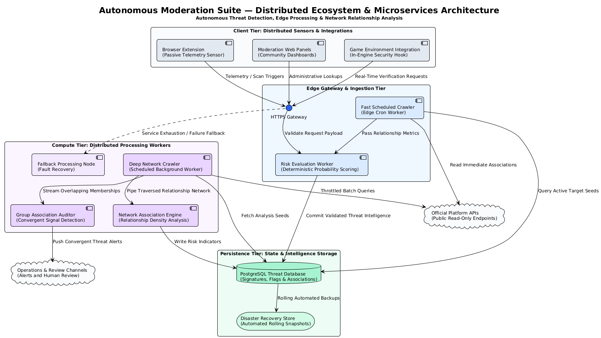

# Autonomous Community Moderation & Safety Suite

## Overview

The Autonomous Moderation Suite is an autonomous community moderation and safety ecosystem designed to identify and respond to suspicious activity across web, browser-extension, and social-gaming environments.

The system is architected as a distributed telemetry, analysis, and risk-scoring pipeline. Separate components are responsible for collecting signals, performing network analysis, evaluating risk, persisting threat intelligence, and recovering from infrastructure failures.

A core design principle is deterministic and explainable risk scoring rather than relying on an opaque AI model for final threat classification. Individual signals and thresholds can therefore be inspected, adjusted, and refined as new behavioral patterns are discovered.

The ecosystem consists of three primary subsystems:

- Client-side sensor layer: browser extension sensors, page-level telemetry, moderation dashboards, and game integrations.
- Cloud gateway and scoring layer: request validation, deterministic probability-based risk evaluation, noise filtering, and decision enforcement.
- Backend intelligence layer: asynchronous crawler engines, network analysis, threat database persistence, alerting, and human-in-the-loop review for ambiguous targets.

---

## Architecture

The production ecosystem follows a layered distributed architecture:



At a high level, the system can be understood through four layers:

1. Client / Sensor Layer
   Collects telemetry and initiates moderation checks from browsers, dashboards, and game environments.

2. Edge / Ingestion Layer
   Receives, validates, and routes incoming requests before they reach heavier processing components.

3. Distributed Compute Layer
   Performs scheduled crawling, relationship analysis, group analysis, network mapping, and probabilistic risk evaluation.

4. Persistence & Recovery Layer
   Stores threat intelligence, maintains the master ledger, and provides automated disaster-recovery mechanisms.

The architecture was designed around practical constraints including external API rate limits, restricted scanning windows, intermittent service availability, and the need to process several workloads independently.

---

## Core Features

### Distributed Telemetry Fabric

Multiple independent sources can feed information into the moderation pipeline:

- Browser extension sensors
- Moderation dashboards
- Game-environment integrations
- Page-level telemetry
- Administrative scan requests

This allows the suite to operate across different environments while maintaining a common risk-analysis pipeline.

### Deterministic Risk Scoring

The gateway and scoring engine use explicit probability and weighting rules rather than an opaque AI model for final threat classification.

Signals can include:

- Flagged group associations
- Friend and network relationships
- Profile information
- Bio and display-name indicators
- Convergent threat signals
- Previously identified associations

The objective is to make classifications explainable and reduce over-flagging caused by isolated or accidental associations.

### Autonomous Crawler Network

Background workers continuously build and refresh threat intelligence.

The crawler network operates on scheduled intervals and performs deeper scans of community relationships, group memberships, and network associations.

A scheduled deep crawler performs heavier background processing and continuously expands the system's threat intelligence database.

### Network-Based Detection

The suite does not rely exclusively on direct indicators such as group membership.

The system can analyze relationships between accounts and previously identified threats. This helps identify actors who deliberately avoid obvious indicators in order to bypass simpler moderation systems.

### Resilience & Fault Recovery

The distributed architecture incorporates:

- Scheduled workers
- Timed retries
- Caching
- Fallback processing nodes
- Fault-recovery mechanisms
- Automated database backups
- Disaster-recovery storage

The objective is to prevent the failure of an individual component or temporary external-service limitation from bringing down the complete moderation pipeline.

### Quarantine & Human Review

High-confidence detections can proceed through automated enforcement and alerting.

Borderline cases can instead be isolated and reviewed before being committed to the primary threat database, reducing the risk of automatically acting on uncertain signals.

### Real-Time Enforcement & Alerting

Threat intelligence can be distributed through:

- Operational webhooks
- Moderation dashboards
- Game-side integrations
- Operational alert channels

Confirmed threats can therefore be surfaced to moderators or acted upon automatically in supported environments.

---

## System Pipeline

### 1. Client & Sensor Layer

The suite can receive information from several distributed entry points.

Browser extensions can collect relevant page-level telemetry and identify associations such as flagged profiles and network relationships.

Moderation dashboards and game integrations can also initiate account or player risk checks.

These observations are passed to the edge gateway for validation and processing.

### 2. Edge Gateway & Ingestion

Incoming requests first reach the edge gateway.

The gateway is responsible for:

- Request validation
- Payload verification
- Lightweight filtering
- Routing
- Passing relevant observations to the processing layer

Keeping the client-facing entry point separate from heavier analysis allows resource-intensive workloads to remain isolated from incoming requests.

### 3. Distributed Compute Layer

The compute layer contains several workers with different responsibilities.

These include:

- Scheduled crawling
- Deep network exploration
- Group relationship analysis
- Network association analysis
- Risk evaluation
- Fallback processing

The workloads are intentionally separated because external platform APIs impose practical constraints such as rate limits and restricted scanning windows.

Instead of relying on one monolithic process, the suite distributes workloads across independent workers and uses caching, retries, and fallback paths to improve resilience and maximize useful processing within those constraints.

### 4. Risk Evaluation

Signals gathered by the different processing workers are passed to the risk engine.

The risk engine combines multiple signals into an explicit risk evaluation and classification.

Rather than treating a single association as definitive evidence, the system can combine multiple converging indicators to determine whether a target should be considered low-risk, suspicious, or high-confidence.

This approach also makes the detection logic easier to inspect and refine when new behavioral patterns are discovered.

### 5. Threat Intelligence Persistence

Validated threat intelligence is persisted in the central PostgreSQL database.

The database maintains information such as:

- Threat signatures
- Flagged accounts
- Community associations
- Network relationships
- Detection signals

Threat intelligence can subsequently be distributed back to supported sensors and integrations, allowing newly discovered information to improve future detection.

### 6. Alerting & Enforcement

Processed threat intelligence can be distributed through operational channels and integrated environments.

Depending on the deployment, outputs may include:

- Operational alerts
- Moderation dashboard reports
- Threat intelligence feeds
- Game-side enforcement actions

This allows the system to move from passive detection toward autonomous moderation workflows.

---

## Engineering Challenges & Design Decisions

### API Constraints & Rate Limits

External platform APIs introduced practical limitations, particularly rate limits and restricted scanning windows.

Instead of allowing these limitations to dictate the entire architecture, the suite distributes work across independent workers and uses scheduled processing, caching, retries, and fallback mechanisms.

This allows the system to continue making progress even when individual requests or workers encounter temporary limitations.

### Detection Blind Spots

The original detection approach relied heavily on direct group-based indicators.

During operation, it became apparent that some actors could deliberately avoid suspicious group memberships, allowing them to bypass that particular detection signal.

The detection pipeline was therefore extended to also consider network relationships.

For example, an account could receive an additional risk signal when a sufficiently high proportion of its immediate network had already been flagged.

This allowed the suite to identify certain accounts that would otherwise have remained invisible to the original detection approach.

### Distributed Failure Handling

A failure in one processing component should not necessarily stop the entire moderation pipeline.

The suite therefore separates major workloads into independent workers and maintains fallback processing paths.

Timed retries and caching also help reduce the impact of transient service failures and repeated requests.

### Ambiguous Detections

Fully autonomous enforcement introduces the risk of acting on uncertain signals.

The suite therefore allows borderline detections to be isolated for human validation instead of immediately treating every uncertain result as a confirmed threat.

This provides a balance between automation and operational safety.

---

## Deployment & Infrastructure

The production suite operates across a distributed cloud pipeline designed for low-latency request handling and resilient background processing.

### Edge Telemetry Gateway

The primary client-facing API and edge validation layer is hosted using Cloudflare Workers / Pages for low-latency request handling and lightweight edge processing.

### Background Processing & Crawlers

The autonomous crawler network and fallback worker nodes run as asynchronous background services on Render.

These workers handle scheduled scans, network traversal, relationship analysis, and other processing tasks that are better suited to background execution.

### Data Persistence & Disaster Recovery

The core threat intelligence database is maintained using PostgreSQL through Supabase.

Automated database snapshots are retained in separate disaster-recovery storage using a rolling retention strategy, providing a recovery path in the event of primary-storage loss or corruption.

---

## Deployment Outcome

The system has been actively deployed and continuously expanding its threat intelligence database.

As of September 2026, the suite has algorithmically flagged more than **22,500 accounts**, with the count continuing to grow through its scheduled crawler network.

The system has operated without direct infrastructure operating expenditure, relying on distributed cloud services, scheduled workers, caching, retries, fallback processing, and automated recovery mechanisms.

The 22,500+ figure represents accounts **flagged by the system**, rather than a claim that every flagged account has been independently confirmed as malicious.

---

## Technology

### Frontend

- React
- Vite
- Tailwind CSS
- Framer Motion

### Cloud & Infrastructure

- Cloudflare Workers / Pages
- Render
- PostgreSQL
- Supabase
- Backblaze B2

### Processing

- JavaScript / TypeScript
- Python
- Scheduled asynchronous workers
- Deterministic probabilistic scoring
- Network and relationship analysis

### Integrations

- Browser extension APIs
- Webhooks
- Game telemetry
- Moderation dashboards

---

## Repository Structure

```text
autonomous-moderation-suite/
  ├─ public/                 # Static assets and favicon
  ├─ src/                    # Landing page source code
  │   ├─ assets/             # Visual assets used by page components
  │   ├─ components/         # Feature sections, architecture, developer integration, forms
  │   ├─ App.jsx             # Root app component and global experience state
  │   ├─ main.jsx            # Vite entry point
  │   ├─ index.css           # Global styling and theme rules
  │   └─ App.css             # Additional style declarations
  ├─ assets/
  │   └─ Architecture.png   # Distributed system architecture diagram
  ├─ package.json            # Frontend dependencies and scripts
  ├─ tailwind.config.js      # Tailwind utility configuration
  ├─ postcss.config.js       # PostCSS setup
  ├─ vite.config.js          # Vite build configuration
  └─ README.md               # Project documentation
```

---

## Setup

1. Install dependencies:

```bash
npm install
```

2. Run the development server:

```bash
npm run dev
```

3. Build for production:

```bash
npm run build
```

4. Preview the production build locally:

```bash
npm run preview
```

---

## Usage

- Launch the Vite application to review the public-facing landing experience.
- Review the `src/components/Architecture.jsx` section for the multi-phase distributed detection flow.
- Review the `src/components/DeveloperIntegration.jsx` example for game telemetry integration and webhook logging patterns.
- Use this repository as the public interface and architecture layer while private cloud services and operational assets remain separated.

---

## Notes for Recruiters & Enterprise Review

This project is designed as a secure enterprise-oriented engineering artifact.

The public repository provides the landing portal, architecture narrative, integration references, and developer flows while preserving the confidentiality of production deployment details.

The production ecosystem contains additional operational components and infrastructure that are intentionally not included in this repository.

---

## Privacy & Security

Core production deployment credentials, API secrets, private infrastructure configurations, sensitive extension code, and operational deployment identifiers are intentionally omitted from this public repository.

This separation allows the architecture and engineering principles of the system to be documented without exposing operational infrastructure or information that could compromise the safety of the system or its developers.
