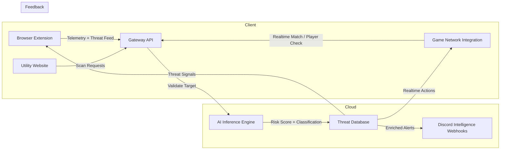

# Autonomous Community Moderation & Safety Suite

## Overview

This repository documents an Autonomous Moderation Suite designed to protect distributed communities across web, browser extension, and social gaming environments. The system is architected as a layered telemetry and scoring pipeline that emphasizes deterministic probability math, not opaque AI-based automation, for final threat classification.

The product ecosystem includes three primary subsystems:

- Client-side sensor layer: browser extension implants and page-level DOM scanning for live telemetry collection,
- Cloud gateway and scoring engine: deterministic probability-based risk math, noise filtering, and decision enforcement,
- Backend intelligence layer: async crawler engines, threat database persistence, and human-in-the-loop review for ambiguous targets.

This public repository captures the ecosystem architecture, onboarding flow, and integration references. Sensitive assets such as private extension payloads, deploy keys, API secrets, and infrastructure configuration are intentionally excluded.

## Core Features

- Distributed telemetry fabric: browser extension sensors, web dashboard tools, and game subsystem hooks feed the suite with contextual signal data.
- Deterministic probability scoring: the gateway applies explicit group/friend/bio/name weights and hard-limit rules to classify threat tiers.
- Real-time enforcement: secure API endpoints and webhook outputs enable rapid action, including game-side auto-removals and operational alerts.
- Autonomous crawler network: async Node/Render workers map hidden community hubs, intersect common members, and refresh threat intelligence on schedule.
- Quarantine and review workflow: borderline targets are isolated and batched for human validation before being committed to the master database.
- Enterprise integration references: documented Lua, webhook, and telemetry examples for safe deployment in moderated environments.

## System Pipeline

1. Client sensors collect signals in browser and game environments.
   - The Chrome/Firefox extension uses zero-touch DOM injection and list scanning to identify flagged profiles, terminated relationships, and network associations.
   - Utility dashboards and game subsystems generate scan requests, group probes, and player risk feeds.
2. Edge gateway receives observations and applies probability scoring.
   - The gateway API computes weighted scores from flagged groups, friends, bio keywords, and display name signals.
   - It prioritizes deterministic math rules to avoid over-flagging accidental associations.
3. Scoring engine evaluates the probability profile and enforces tiered outcomes.
   - High-confidence threats are classified immediately and routed to enforcement and alerting channels.
   - Ambiguous cases are placed into quarantine and escalated for human review rather than being auto-committed.
4. Threat database commits validated actors and network hubs.
   - Confirmed risks feed the master ledger and update distribution back to client sensors for improved detection.
   - The system maintains association graphs across groups, friends, and terminated accounts for ongoing signal refinement.
5. Alerting and enforcement outputs are dispatched.
   - Discord intelligence webhooks and dashboard reports deliver actionable operational intelligence.
   - Game integrations can remove confirmed malicious actors automatically in real time.

## System Architecture Diagram



## Tech Stack

- JavaScript / TypeScript-compatible React frontend
- Vite application pipeline
- Tailwind CSS for scalable UI styling
- Framer Motion for motion-driven information presentation
- Web Extension manifest architecture implied for browser telemetry and local scanning
- Python-backed API endpoints and inference services (public repo contains integration documents, not full backend source)
- Probabilistic math for risk classification and content inspection
- Cloud telemetry and edge gateway components for low-latency validation

## Folder Structure

```text
scout-landing/
  ├─ public/                 # Static assets and favicon
  ├─ src/                    # Landing page source code
  │   ├─ assets/             # Visual assets used by page components
  │   ├─ components/         # Feature sections, architecture, developer integration, forms
  │   ├─ App.jsx             # Root app component and global experience state
  │   ├─ main.jsx            # Vite entry point
  │   ├─ index.css           # Global styling and theme rules
  │   └─ App.css             # Additional style declarations
  ├─ package.json            # Frontend dependencies and scripts
  ├─ tailwind.config.js      # Tailwind utility configuration
  ├─ postcss.config.js       # PostCSS setup
  ├─ vite.config.js          # Vite build configuration
  └─ README.md               # Project documentation
```

## Setup

1. Install dependencies:

```bash
npm install
```

2. Run the development server:

```bash
npm run dev
```

3. Build for production:

```bash
npm run build
```

4. Preview the production build locally:

```bash
npm run preview
```

## Usage

- Launch the Vite application to review the public-facing landing experience.
- Review the `src/components/Architecture.jsx` section for the multi-phase distributed detection flow.
- Review the `src/components/DeveloperIntegration.jsx` example for Lua / game telemetry integration and webhook logging patterns.
- Use this repository as the public interface layer while private cloud services and extension payloads remain separated for operational security.

## Notes for Recruiters & Enterprise Review

This project is designed as a secure enterprise engineering artifact. The public repository provides the landing portal, architecture narrative, integration reference, and developer flows while preserving the confidentiality of production deployment details.

## Privacy & Security

Core production deployment credentials, API secrets, private infrastructure configurations, and sensitive extension code are intentionally omitted from this public repo to protect the system, developers, and end users.
